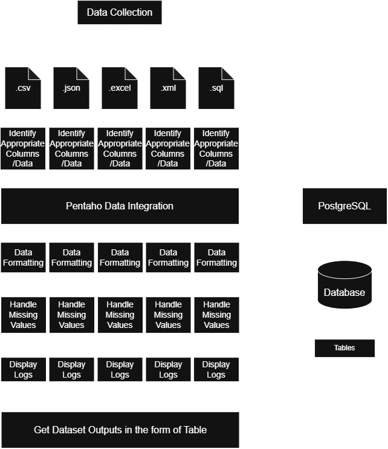

# Business Requirement Document

**Project:** Enterprise Energy Data Platform (EEDP)
**Team:**
```text
Perseus Mistry
Sai Skanda U
Jai Krishna
```
**Date Created:** 18/08/2026

## Business Problem
The organization has a large volume of data coming from multiple sources. The raw data is difficult to process and analyze directly because it may be distributed, inconsistent, unstructured, or generated continuously. The project aims to build a data engineering pipeline that collects, cleans, transforms, stores, and makes this data available for analytics and decision-making.

## Project Objectives
- Integrate data from multiple sources into a unified data environment, enabling centralized access to relevant information.
- Improve data quality and consistency by addressing issues such as missing, duplicate, inconsistent, and improperly formatted data.
- Efficiently process and transform large volumes of data into structured, analysis-ready information.
- Provide reliable and accessible data for analytics and reporting, allowing users to derive meaningful insights from the collected data.
- Support faster and more informed business decision-making by providing accurate, timely, and usable data.

## Business Stakeholders
| **Stakeholder**                                | **Role in the Project**                                                                                              |
| ------------------------------------------ | ---------------------------------------------------------------------------------------------------------------- |
| **Business Management / Decision Makers**  | Use insights and reports generated from the processed data to make strategic and operational decisions.          |
| **Data Analysts**                          | Use cleaned and structured data to perform analysis, identify trends, and generate reports or dashboards.        |
| **Data Engineers**                         | Design, build, and maintain the data pipeline for collecting, processing, transforming, and storing data.        |
| **Data Scientists / ML Teams**             | Use processed data for advanced analytics, predictive modelling, or machine-learning applications when required. |
| **Data Source Owners / Operational Teams** | Generate or maintain the original data and provide information about its format, meaning, and business context.  |
| **IT / System Administrators**             | Manage the infrastructure, databases, access controls, and deployment environment supporting the data pipeline.  |
| **Compliance / Data Governance Team**      | Ensure that data is handled securely, consistently, and according to organizational policies and regulations.    |

## Project Scope and Tools Used
| Scope Area                    | Description                                                                                         | Tools / Technologies                                          |
| ----------------------------- | --------------------------------------------------------------------------------------------------- | ------------------------------------------------------------- |
| **Data Collection**           | Collect the required raw data from the identified data sources for the project.                     | **CSV / Excel / Database / XML / SQL** |
| **Data Ingestion**            | Import the collected data into the ETL workflow for further processing.                             | **Pentaho Data Integration (PDI / Spoon)**                    |
| **Data Cleaning**             | Handle missing values, duplicate records, incorrect formats, and other data-quality issues.         | **Pentaho Data Integration (PDI)**                            |
| **Data Transformation**       | Transform and restructure the raw data into a suitable format for analysis and reporting.           | **Pentaho Data Integration (PDI / Spoon)**                    |
| **Data Integration**          | Combine data from the required sources and create a consistent, integrated dataset.                 | **Pentaho Data Integration (PDI)**                            |
| **Data Storage**              | Store the processed data in the required database/storage system for subsequent use.                | **Database specified for the project + Pentaho PDI**          |
| **Data Quality / Validation** | Check the processed data for completeness, consistency, duplicates, and other basic quality issues. | **Pentaho Data Integration, SQL**                             |
| **Data Analysis / Reporting** | Use the processed data to generate the required analysis, reports, or business insights.            | **SQL + the visualization/reporting tool specified in UC6**   |
| **ETL Workflow**              | Develop a repeatable ETL workflow connecting extraction, transformation, and loading stages.        | **Pentaho Data Integration (Spoon)**                          |

## Data Sources
| No. | Enterprise Data Source                    | What it Represents                                                                             | How We Use It                                                                                 |
| --: | ----------------------------------------- | ---------------------------------------------------------------------------------------------- | --------------------------------------------------------------------------------------------- |
|   1 | **Relational Databases**                  | Structured operational data stored in tables, such as customer, sales, or transaction records. | Extract structured data using database connections and integrate it into the ETL pipeline.    |
|   2 | **CSV / Flat Files**                      | Data stored in files, often generated by different departments or external systems.            | Import and transform file-based data into a consistent format.                                |
|   3 | **Excel / Spreadsheet Files**             | Business data maintained manually by departments, such as reports, targets, or reference data. | Extract spreadsheet data and integrate it with other enterprise data.                         |
|   4 | **XML / JSON Data**                       | Semi-structured data exchanged between applications and systems.                               | Parse and transform semi-structured data into a format suitable for integration and analysis. |

## Architecture Diagram

